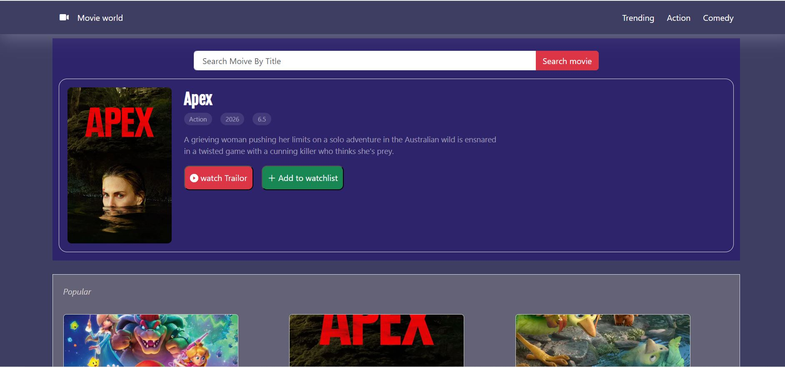
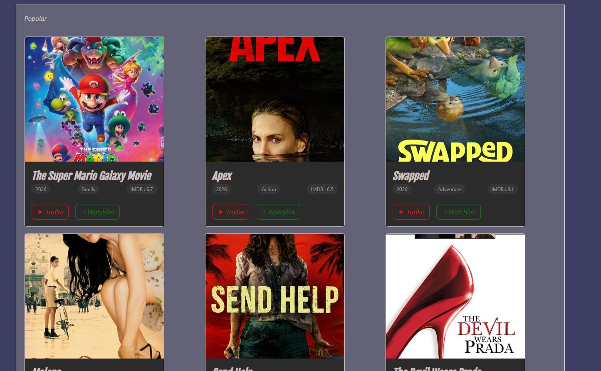
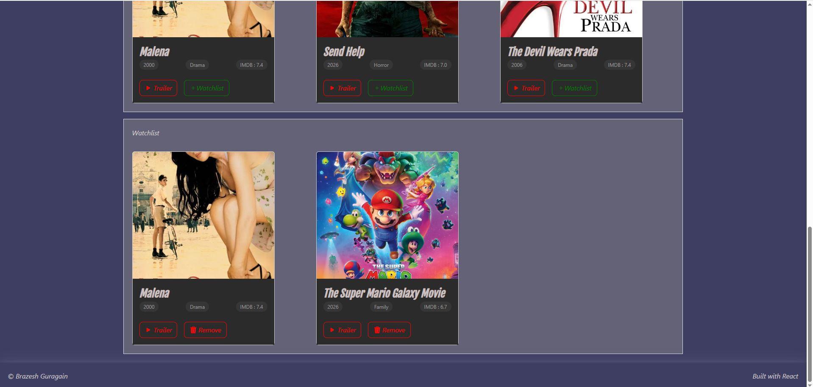

# CineTrial

Movie World is a React-based movie discovery app powered by the TMDB API. Browse popular, trending, and genre-based movies, watch trailers in a modal overlay, and save your favourites to a persistent watchlist — all in one place, no login required.

## Table of contents

1. [Screenshots](#screenshots)
2. [Features](#features)
3. [Techstack](#techstack)
4. [How to Use ](#how-to-use)
5. [API Endpoints Used](#api-endpoints-used)
6. [Eniviroment Variables](#enviroments-variables)
7. [Project Structure](#project-structure)
8. [License](#license)
9. [Contact](#contact)

## Screenshots





## Features

- **Hero Section** — Displays a random popular movie on load with title, genre, release year, and rating
- **Movie Search** — Search any movie by title and display it in the hero section
- **Trailer Playback** — Watch trailers in a modal overlay powered by YouTube embed
- **Movie Sections** — Browse movies by category: Popular, Trending, Action, and Comedy
- **Watchlist** — Add or remove movies from your watchlist, persisted via localStorage
- **Responsive Design** — Built with Bootstrap 5 for mobile and desktop support

## Tech Stack

- **React** — Component-based UI
- **Vite** — Development build tool
- **Axios** — HTTP requests to TMDB API
- **Bootstrap 5** — Styling and layout
- **TMDB API** — Movie data, trailers, and genre info
- **localStorage** — Watchlist persistence across sessions

## How to use

1. Clone the repository

   ```bash
   git clone https://github.com/bguragain1023-web/CineTrial.git
   cd CineTrial
   ```

2. Install dependencies

   ```bash
   yarn
   ```

3. Create a `.env` file in the root directory

   ```env
   VITE_TMDB_API_KEY=your_api_key_here
   VITE_TMDB_TOKEN=your_read_access_token_here
   ```

4. Start the development server

   ```bash
   yarn dev
   ```

   -Get your free API key from (https://www.themoviedb.org/settings/api)

   ## API Endpoints Used

| Feature         | Endpoint                       |
| --------------- | ------------------------------ |
| Popular Movies  | `/movie/popular`               |
| Trending Movies | `/trending/movie/day`          |
| Search Movies   | `/search/movie?query=`         |
| Movies by Genre | `/discover/movie?with_genres=` |
| Movie Trailer   | `/movie/{id}/videos`           |
| Genre List      | `/genre/movie/list`            |

## Environment Variables

| Variable            | Description                                        |
| ------------------- | -------------------------------------------------- |
| `VITE_TMDB_API_KEY` | Your TMDB API key                                  |
| `VITE_TMDB_TOKEN`   | Your TMDB read access token (used for Bearer auth) |

## Project Structure

```
src/
├── components/
│   ├── Navbar.jsx       # Navigation with category links
│   ├── Hero.jsx         # Featured movie with search
│   ├── Display.jsx      # Movie grid and watchlist
│   ├── Moviecard.jsx    # Individual movie card
│   └── Footer.jsx       # Footer
├── utils/
│   ├── axios.js         # All TMDB API fetch functions
│   └── localStorage.js  # localStorage utility functions
├── App.jsx              # Root component, state management
└── App.css              # Global styles
```

## License

This project is open source and available under the [MIT License](LICENSE).

## contact

- Brazesh Gurgain
- Location:Hobart Tasmania
- linkdln: [https://www.linkedin.com/in/brazesh-guragain-32a6661b0/?skipRedirect=true]
- website: brazeshguragain.com
- b.guragain1023@gmail.com
